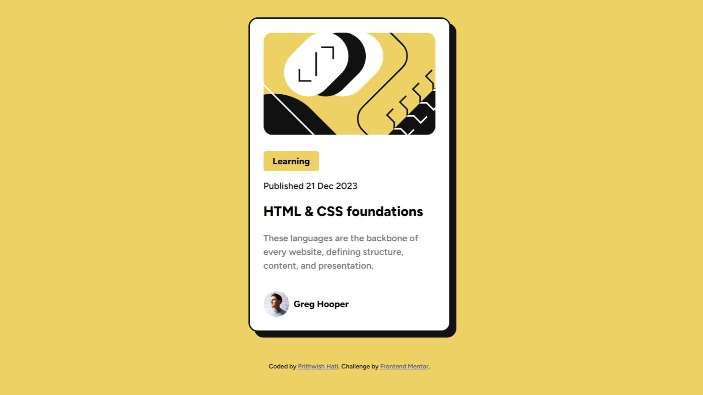

# Frontend Mentor - Blog preview card solution

This is a solution to the [Blog preview card challenge on Frontend Mentor](https://www.frontendmentor.io/challenges/blog-preview-card-ckPaj01IcS).

## Table of contents

- [Overview](#overview)
  - [The challenge](#the-challenge)
  - [Screenshot](#screenshot)
  - [Links](#links)
- [My process](#my-process)
  - [Built with](#built-with)
  - [What I learned](#what-i-learned)
  - [Useful resources](#useful-resources)
- [Author](#author)

## Overview

### The challenge

Users should be able to:

- See hover and focus states for all interactive elements on the page

### Screenshot

### Links

Live Site URL: [blog-preview-card-ph.vercel.app](https://blog-preview-card-ph.vercel.app/)

## My process

### Built with

- Semantic HTML5 markup
- CSS custom properties
- CSS Box Shadow
- Mobile-first workflow

### What I learned

CSS Box Shadow

## Author

- Website - [Prithwish Hati](https://www.prithwish.vercel.app)
- Frontend Mentor - [@Prithwish-Hati](https://www.frontendmentor.io/profile/prithwish-hati)
- Twitter - [@PrithwishHati](https://www.twitter.com/PrithwishHati)
